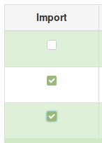
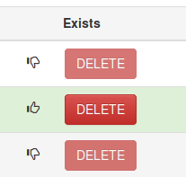

# Short How-To

## Select category and import

1. Use dropdownbox to select category which should be listed. 

2. The checkmarks in first column indicates if the row is able to import.

3. Choose which rows you want to import as an Wordpress Event, by selec/unselect checkmarks. (**Checkmark** = import)

4. Press the **Importer iCal Data**, which then will import the selected events in Wordpress. If the row (EVENT) exists in wordpress, the import will update dates, title and description content. All other fields which is adjusted in post will not be changed.

## Delete Event from Wordpress

5. On each EVENT row, the button **Delete** is enabled if the event exists in Wordpress.

6. Pressing the **Delete** button will delete the Event from wordpress.

## Log text area

This text component contains information on actions - used for debugging purposes.

